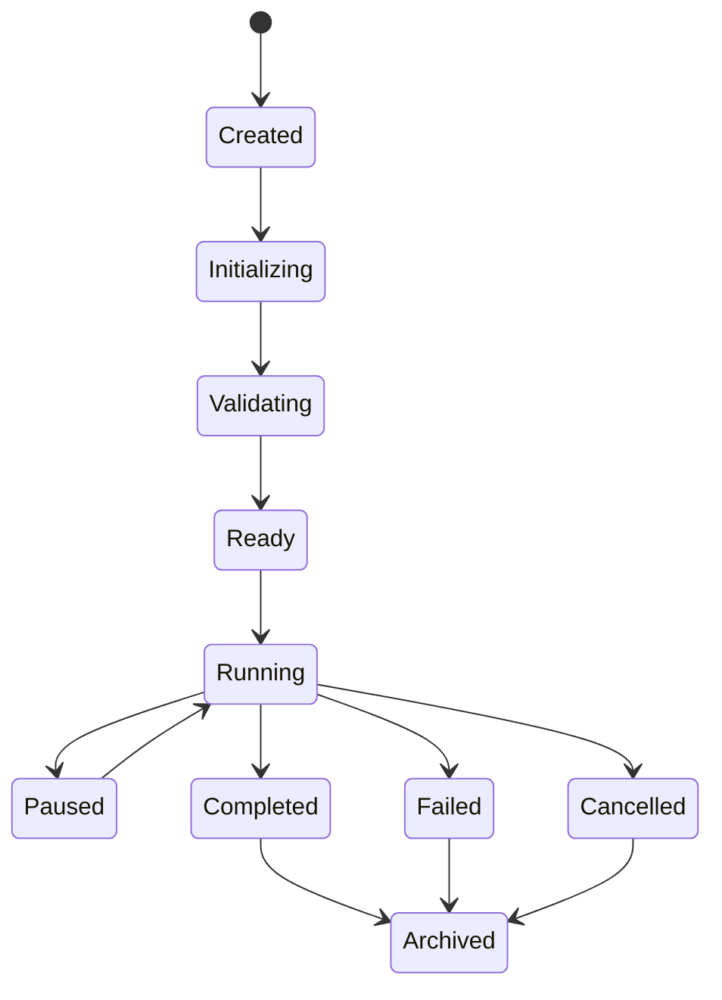

# Workflow Execution

Version: 1.0

Status: Draft

---

# Purpose

A **Workflow Execution** is a runtime instance of a Workflow Definition.

It represents one complete execution of a workflow from initialization to completion.

Every execution is isolated and self-contained. All runtime state, logs, reports, artifacts, variables, and events belong exclusively to a single Workflow Execution.

A Workflow Execution is the central runtime object of the Entropy platform.

---

# Design Goals

Workflow Execution exists to provide:

- Execution isolation
- Deterministic execution
- Runtime state management
- Event publication
- Artifact ownership
- Workspace isolation
- Report generation
- Auditability
- Recoverability
- Observability

---

# Core Principle

A Workflow Definition describes **what should happen**.

A Workflow Execution records **what actually happened**.

Workflow Definitions are immutable.

Workflow Executions are transient runtime objects.

---

# Responsibilities

Workflow Execution is responsible for:

- Managing execution lifecycle
- Maintaining runtime state
- Coordinating step execution
- Owning runtime resources
- Publishing execution events
- Recording execution metadata
- Tracking execution metrics
- Producing execution reports
- Managing artifacts
- Managing workspace

Workflow Execution is NOT responsible for:

- Authentication
- Plugin discovery
- CLI interaction
- Configuration loading
- Business logic

---

# Ownership Model

Workflow Execution owns every runtime object created during execution.

```
WorkflowExecution
│
├── Execution Metadata
├── Execution State
├── Workspace
├── Variables
├── Secrets
├── Logger
├── Event Bus
├── Report Builder
├── Artifact Manager
├── Metrics
├── Timeline
└── Step Results
```

No runtime object exists without an owner.

---

# Lifecycle

Every execution follows the same lifecycle.

```text
Created

↓

Initializing

↓

Validating

↓

Ready

↓

Running

↓

Paused

↓

Completed

or

Failed

or

Cancelled

↓

Archived
```

---

# State Definitions

## Created

Execution object exists.

Nothing has been initialized.

---

## Initializing

Runtime services are being prepared.

Examples

- Workspace creation
- Logger creation
- Variable initialization

---

## Validating

Workflow validation is performed.

Examples

- Schema validation
- Plugin validation
- Dependency validation

No plugin execution occurs during this phase.

---

## Ready

Execution is fully initialized.

Waiting for execution to begin.

---

## Running

Workflow steps are executed.

Plugins are invoked.

Events are published.

Artifacts are generated.

---

## Paused

Execution is temporarily suspended.

No plugins execute.

Runtime state remains intact.

---

## Completed

Execution finished successfully.

Reports are generated.

Workspace remains available.

---

## Failed

Execution terminated because of an unrecoverable error.

Failure information is preserved.

---

## Cancelled

Execution terminated by user or administrator.

Cleanup still occurs.

---

## Archived

Execution is no longer active.

Only historical information remains.

---

# State Diagram



---

# Execution Metadata

Every execution records immutable metadata.

Example

```json
{
  "execution_id": "20260730-104512-a7d41e",
  "workflow": "deployment_oracle_release",
  "workflow_version": "2.1.0",
  "user": "admin",
  "environment": "production",
  "status": "Running",
  "started_at": "2026-07-30T10:45:12Z"
}
```

---

# Runtime Resources

Each Workflow Execution owns the following resources.

## Workspace

Stores runtime files.

---

## Variables

Resolved configuration values.

---

## Secrets

Resolved secure values.

---

## Logger

Execution-scoped logging.

---

## Event Bus

Publishes execution events.

---

## Report Builder

Generates execution reports.

---

## Artifact Manager

Tracks generated artifacts.

---

## Metrics

Captures runtime measurements.

---

## Timeline

Records chronological execution history.

---

# Directory Layout

```
runtime/

└── executions/

    └── 20260730-104512-a7d41e/

        execution.json

        workflow.json

        metadata.json

        workspace/

        logs/

        reports/

        artifacts/

        metrics/

        support/
```

Every execution owns exactly one directory.

No execution accesses another execution's workspace.

---

# Execution Timeline

Every significant event contributes to the execution timeline.

Example

```
10:45:12 Execution Created

10:45:13 Validation Started

10:45:16 Validation Completed

10:45:18 SQL Validation Started

10:45:24 SQL Validation Completed

10:45:25 SQL Deployment Started

10:46:10 SQL Deployment Completed

10:46:12 OpenShift Deployment Started

10:47:05 OpenShift Deployment Completed

10:47:10 Report Generation Started

10:47:11 Execution Completed
```

The timeline is generated from execution events.

---

# Step Management

Workflow Execution coordinates step execution.

Each step transitions through its own lifecycle.

```text
Pending

↓

Running

↓

Completed

or

Failed

or

Skipped
```

Workflow Execution records:

- Start time
- End time
- Duration
- Result
- Retry count
- Plugin used

---

# Artifact Ownership

Every generated file becomes an artifact.

Examples

- SQL scripts
- Reports
- CSV files
- JSON output
- Logs

Artifacts are registered with metadata.

Example

```json
{
  "name": "deployment-report.html",
  "type": "report",
  "created_by": "ReportPlugin",
  "timestamp": "...",
  "checksum": "..."
}
```

---

# Event Ownership

Workflow Execution publishes all execution events.

Typical events include

- ExecutionCreated
- ValidationStarted
- StepStarted
- PluginStarted
- PluginCompleted
- StepCompleted
- ArtifactCreated
- ExecutionCompleted

Events are immutable.

Events are the source of truth.

---

# Logging

Workflow Execution owns the logger.

Plugins never create loggers.

Plugins receive a logger through the Execution Context.

Log files belong to the execution.

Example

```
logs/

workflow.log

plugin-shell.log

plugin-sqlplus.log

validation.log

error.log
```

---

# Report Generation

Reports summarize execution.

Reports consume events and metadata.

Reports never parse log files.

Supported formats

- HTML
- JSON
- Markdown

Future formats

- PDF

---

# Failure Handling

Workflow Execution is responsible for handling failures.

Failure policies may include:

- Abort execution
- Retry step
- Continue execution
- Rollback
- Manual intervention

Plugins report failures.

Workflow Execution decides the next action.

---

# Cleanup

After completion, Workflow Execution performs cleanup.

Cleanup may include:

- Delete temporary files
- Close open resources
- Flush logs
- Finalize reports
- Archive metadata

Cleanup never deletes retained artifacts.

---

# Retention Policy

Retention policies determine how long execution data is preserved.

Possible strategies:

| Type | Retention |
|------|-----------|
| Successful | 30 days |
| Failed | 90 days |
| Archived | 1 year |

Retention policies are configurable.

---

# Future Capabilities

Future versions may support:

- Parallel execution
- Checkpointing
- Resume after failure
- Distributed execution
- Remote agents
- Execution replay
- Live execution monitoring
- Scheduled execution

---

# Architectural Principles

## Every execution is isolated.

No runtime state is shared.

---

## Every execution owns its resources.

Ownership defines lifecycle.

---

## Events are the source of truth.

Logs and reports are derived views.

---

## Plugins never control execution.

Plugins return results.

Workflow Execution controls execution flow.

---

## Runtime state is transient.

Only execution metadata, reports, artifacts, and events persist after execution.

---

# Summary

Workflow Execution is the runtime heart of Entropy.

It owns the execution lifecycle, runtime resources, execution state, workspace, events, reports, metrics, artifacts, and timeline.

All platform runtime behavior revolves around Workflow Execution.

The remainder of the architecture—including Execution Context, Plugin Framework, Event Model, Observability, and Reporting—builds upon this foundation.
